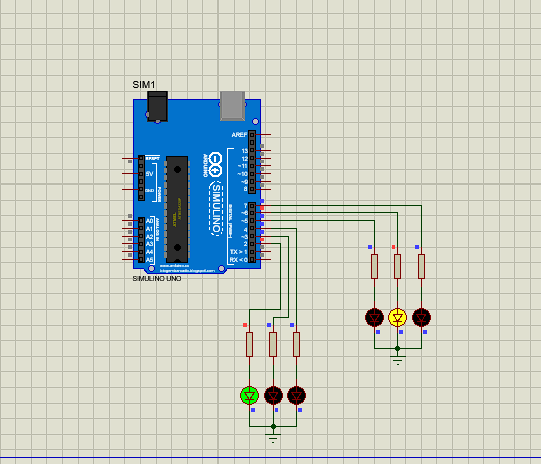
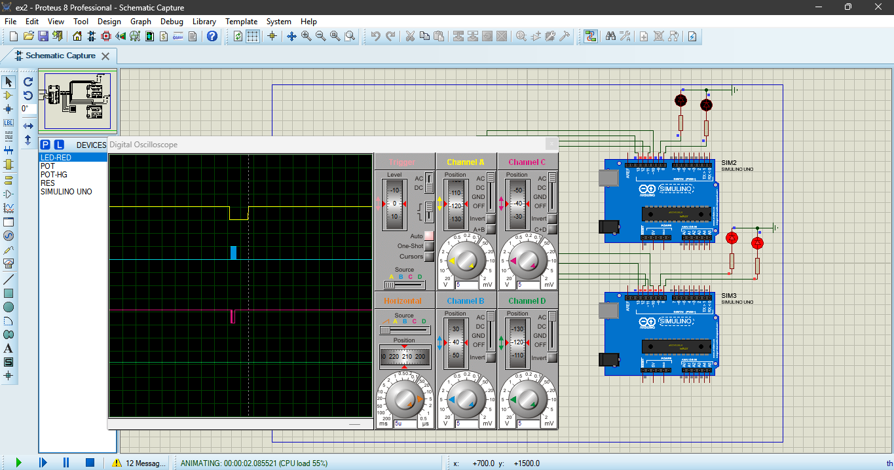

# Embedded Systems Lab - IISE S6  
This repository contains the code and documentation for two embedded systems exercises:  
1. **Traffic Light Control System**  
2. **SPI Communication between Master and Slave Devices**  

## 📁 Repository Structure  

## 🚦 Exercise 1: Traffic Light Control  
- **Objective**: Simulate a two-way traffic light system with adjustable timings.  
- **Components**:  
  - Arduino Uno  
  - LEDs (Red, Yellow, Green)  
  - Resistors (220Ω)  
- **Proteus Schematic**:  
    

## 📡 Exercise 2: SPI Communication  
- **Objective**: Implement SPI communication between one master and two slave Arduinos.  
- **Features**:  
  - Master sends 'A' to Slave 1 and 'B' to Slave 2.  
  - LEDs blink based on potentiometer input (Ve > 3V).  
- **Signal Analysis**:  
    

## 🔧 Setup Instructions  
1. **Software**:  
   - Proteus 8 Professional  
   - Arduino IDE  
2. **Hardware**:  
   - Arduino Uno (x3 for SPI exercise)  
   - LEDs, Resistors, Potentiometer  

## 🚀 How to Run  
1. **Exercise 1**:  
   - Open `Traffic_Lights.pdsprj` in Proteus.  
   - Upload `Traffic_Lights.ino` to the Arduino.  
2. **Exercise 2**:  
   - Open `SPI_Communication.pdsprj`.  
   - Upload `Master_Code.ino` to the master Arduino and `Slave_Code.ino` to slaves.  

## 📊 Results  
- **Traffic Lights**: Sequential LED switching with adjustable delays.  
- **SPI Communication**:  
  - Slave 1 LED toggles on receiving 'A'.  
  - Slave 2 LED toggles on receiving 'B'.  
  - LEDs blink when potentiometer voltage > 3V.  

## 📄 Report  
See the full report here: [Compte_Rendu_TP_IISE_S6.pdf](Rapport/Compte_Rendu_TP_IISE_S6.pdf)  

---  
🛠 **Developed by**: Mohamed Aderak 
📅 **Date**:09 May 2025
